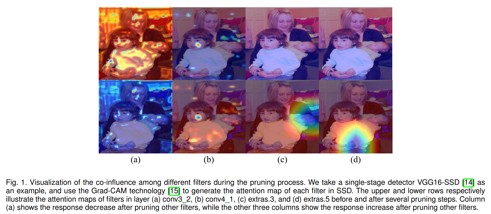
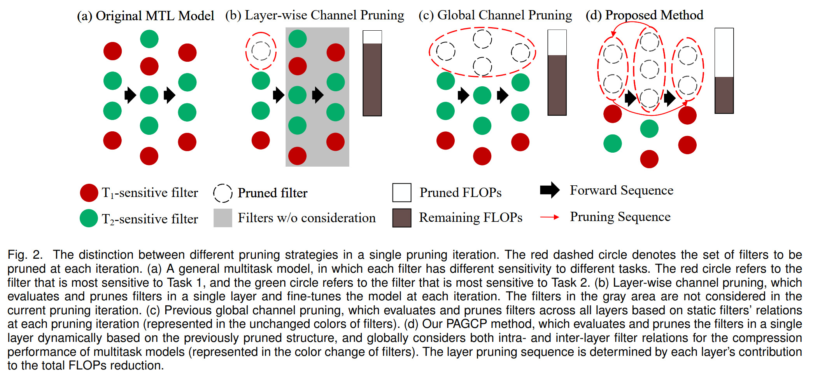
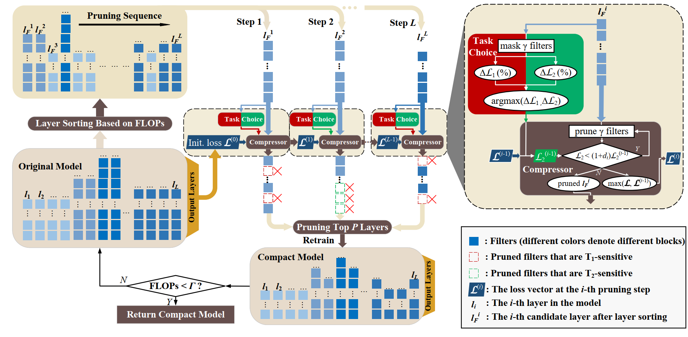
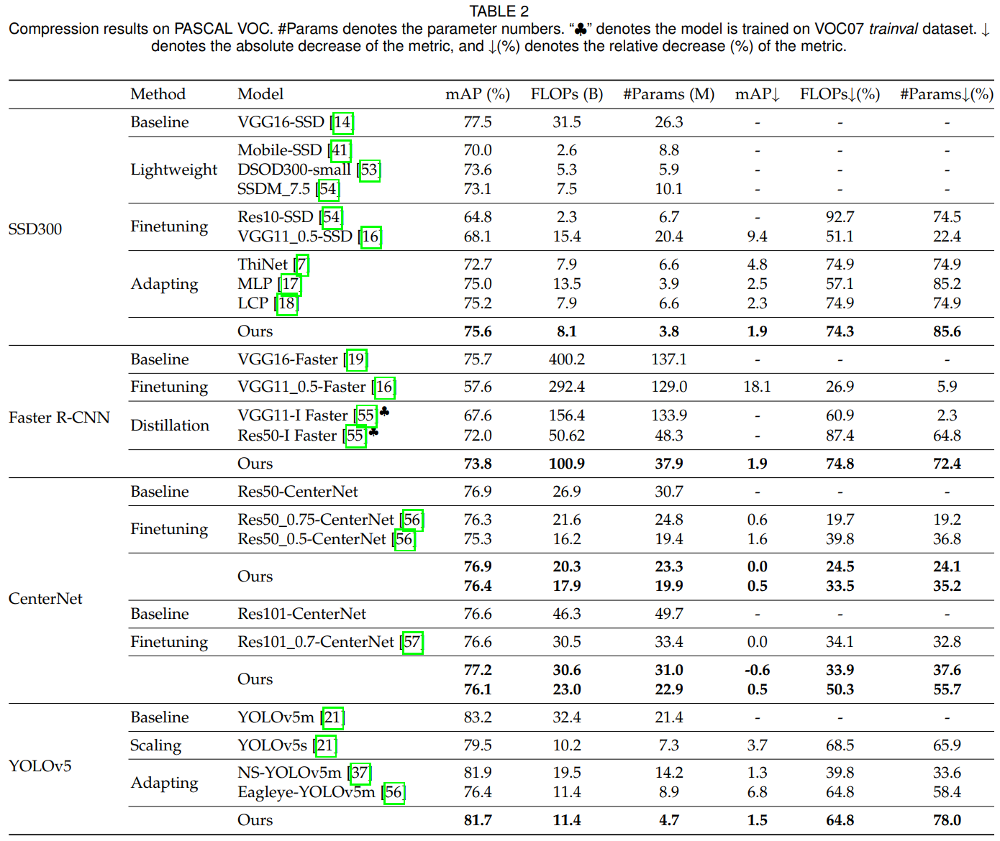
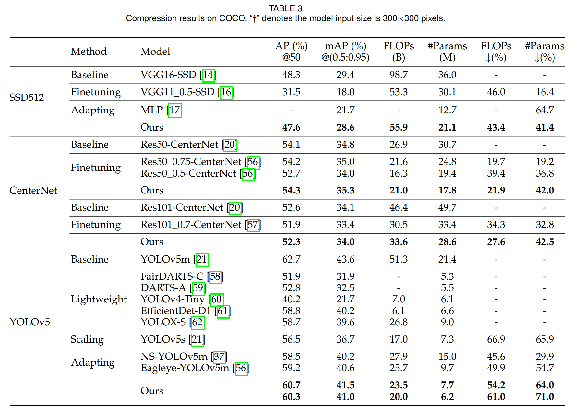
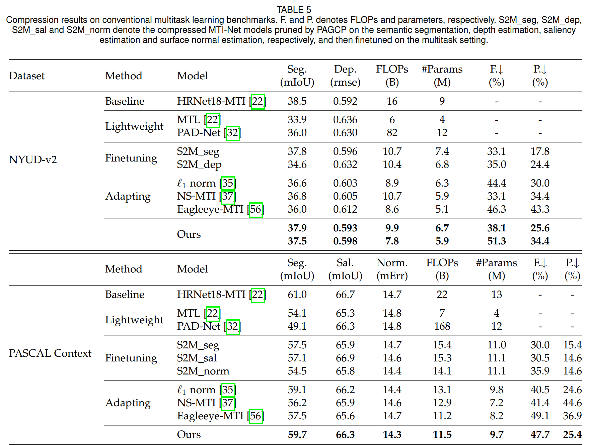
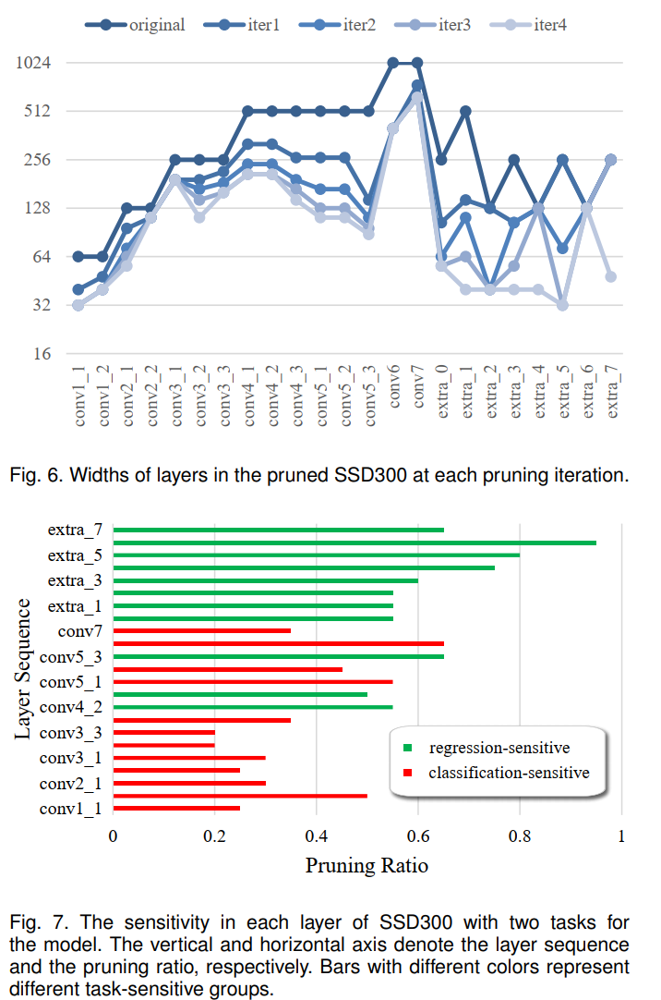

## Abstract
Global channel pruning (GCP) aims to remove a subset of channels (filters) across different layers from a deep model without hurting the performance. Previous works focus on either single task model pruning or simply adapting it to multitask scenario, and still face the following problems when handling multitask pruning: 1) Due to the task mismatch, a well-pruned backbone for classification task focuses on preserving filters that can extract category-sensitive information, causing filters that may be useful for other tasks to be pruned during the backbone pruning stage; 2) For multitask predictions, different filters within or between layers are more closely related and interacted than that for single task prediction, making multitask pruning more difficult. Therefore, aiming at multitask model compression, we propose a Performance-Aware Global Channel Pruning (PAGCP) framework. We first theoretically present the objective for achieving superior GCP, by considering the joint saliency of filters from intra- and inter-layers. Then a sequentially greedy pruning strategy is proposed to optimize the objective, where a performance-aware oracle criterion is developed to evaluate sensitivity of filters to each task and preserve the globally most task-related filters. Experiments on several multitask datasets show that the proposed PAGCP can reduce the FLOPs and parameters by over 60% with minor performance drop, and achieves 1.2x∼3.3x acceleration on both cloud and mobile platforms. Our code is available at http://www.github.com/HankYe/PAGCP.git.

## Motivation

  

  

 

## Framework
The overview of the proposed Performance-Aware Global Channel Pruning (PAGCP) framework. Given an original well-trained multitask model, we sort all target layers in a new sequence based on each layer’s contribution to total FLOPs reduction (computed by subtracting the FLOPs of the pruned model from the FLOPs of the original model), and compress each layer in such sequence.

  

 

## Experimental Results
Our experiments are conducted on PASCAL VOC, COCO2017, PASCAL Context, and NYUD-v2. Our experiments cover object detection, semantic segmentation, depth estimation, saliency estimation, and surface normal estimation tasks. 

  

  

  

  

## Conclusion
In this paper, we propose an effective Performance-Aware
Global Channel Pruning (PAGCP) framework, to compress
various models including object detection, conventional
multitask dense predictions, and even classification. We
theoretically derive the optimization objective of PAGCP,
and develop a sequentially greedy pruning strategy to
approximately solve the objective problem. In particular,
the developed pruning strategy consists of two key modules, including a sequential channel pruning scheme considering different filters’ co-influence on compression performance within and between layers, and a performanceaware oracle criterion considering different tasks have different performance-sensitive filters for keeping. Extensive
experiments on multiple detection, MTL, and classification
datasets demonstrate that the proposed PAGCP can achieve
state-of-the-art compression performance in terms of prediction accuracy, parameter and FLOPs, and also can be well
generalized to various one-stage and two-stage detectors,
MTL models, and classification networks. We also give
the real inference time of the compressed model using the
proposed PAGCP, on both cloud and mobile platforms, to
show the real-time application potential of our compressed
model on mobile devices.

[Download paper here](https://arxiv.org/abs/2303.11923)