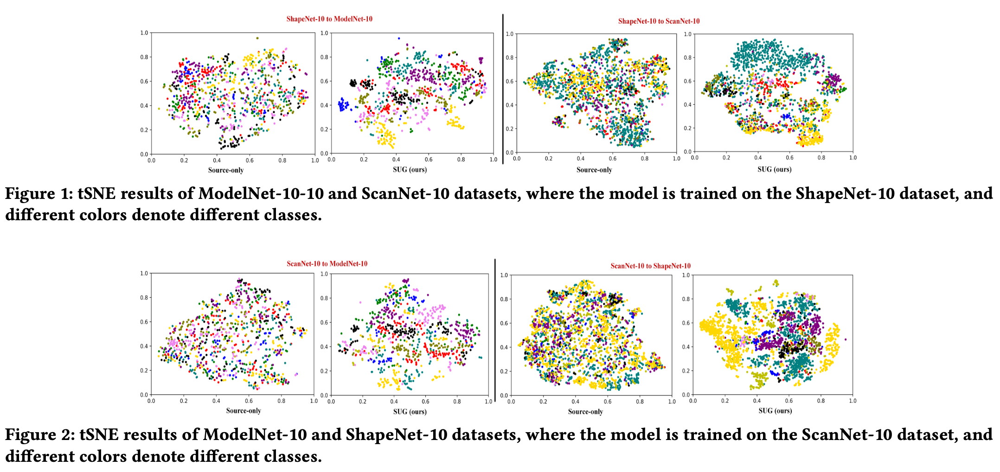
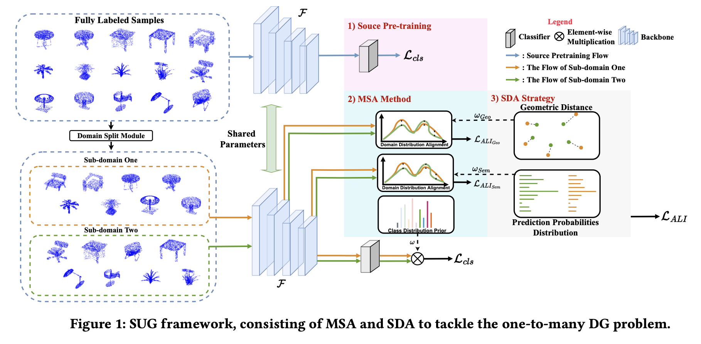
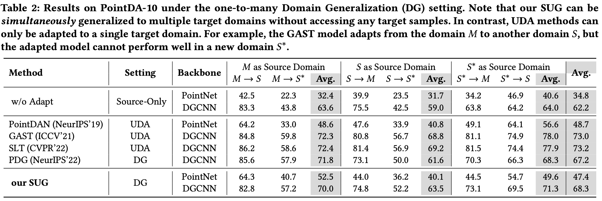

## Abstract
Although Domain Generalization (DG) problem has been fast-growing in the 2D image tasks, its exploration on 3D point cloud data is still insufficient and challenged by more complex and uncertain cross-domain variances with uneven inter-class modality distribution. In this paper, different from previous 2D DG works, we focus on the 3D DG problem and propose a Single-dataset Unified Generalization (SUG) framework that only leverages a single source dataset to alleviate the unforeseen domain differences faced by a well-trained source model. Specifically, we first design a Multi-grained Sub-domain Alignment (MSA) method, which can constrain the learned representations to be domain-agnostic and discriminative, by performing a multi-grained feature alignment process between the splitted sub-domains from the single source dataset. Then, a Sample-level Domain-aware Attention (SDA) strategy is presented, which can selectively enhance easy-to-adapt samples from different sub-domains according to the sample-level inter-domain distance to avoid the negative transfer. Experiments demonstrate that our SUG can boost the generalization ability for unseen target domains, even outperforming the existing unsupervised domain adaptation methods that have to access extensive target domain data.

## Motivation
We aim to provide a preliminary study to investigate the model’s cross-domain generalization ability under the zero-shot target domain constraint, which derivates the task of Domain Generalization (DG) for 3D scenarios.

However, achieving such zero-shot domain adaptation, DG, is more challenging in 3D scenarios, mainly due to the following reasons. 

- Unknown Domain-variance Challenge: 3D point cloud data collected from different sensors or geospatial regions with different data distributions often present serious domain discrepancies. Due to the inaccessibility of the target domain data, modeling of source-to-target domain variance is intangible. 

- Uneven Domain Adaptation Challenge: Considering that our goal is to learn a transferable representation that can be generalized to multiple target domains, a robust model needs to perform an even domain adaptation rather than lean to fit the data distribution on one of the multiple target domains. But for 3D point cloud data with more complex sample-level modality variances, ensuring an even model adaptation under the zero-shot target domains setting remains challenging.

  

 

## Framework
To tackle the above challenges, we study the typical DG problem in the 3D scenario and introduce a Singe-dataset Unified Generalization (SUG) framework to address the 3D point cloud generalization problem. We study a one-to-many domain generalization problem, where the model can be trained on only a single 3D dataset and is required to be simultaneously generalized to multiple target datasets. Different from previous DG works in 2D scenarios, 3D point cloud data have more diverse data distribution within a single dataset, which provides the possibility to exploit the modality variations across different sub-domains without accessing any target-domain datasets. Our SUG framework consists of a Multi-grained Sub-domain Alignment (MSA) method and a Sample-level Domain-aware Attention (SDA) strategy. To address the unknown domain-variance challenge, the SUG first splits the selected single dataset into different sub-domains with a domain split module. Then, based on these sub-domains, the baseline model is constrained to simulate as many domain variances as possible from multi-grained features so that the baseline model can learn multi-grained and multi-domains agnostic representations. The SDA is developed to solve the uneven domain adaptation challenge, which assumes that the instances from different sub-domains often present different adaptation difficulties. Thus, we add sample-level constraints to the whole sub-domain alignment process according to the dynamically changing sample-level inter-domain distance, leading to an even inter-domain adaptation process.

  

 

## Experimental Results
Our experiments are conducted on PointDA-10 dataset under the one-to-many Domain Generalization setting. Our experiments cover many cross-domain settins including ModelNet-to-ShapeNet, ModelNet-to-ScanNet, ShapeNet-to-Model, ShapeNet-to-ScanNet, ScanNet-to-ModelNet, ScanNet-to-ShapeNet. 

  

## Conclusion
We proposed a SUG framework to study the one-to-many DG in 3D scenarios. SUG consists of an MSA method to exploit the data diversity residing in a given source dataset and further learn domain-agnostic and discriminative representations, an SDA strategy to increase the domain adaptation degree for easy-to-adapt instances selectively. Extensive experiments verify that the SUG framework is general and effective in tackling the 3D DG problem.

[Download paper here](https://arxiv.org/abs/2305.09160)