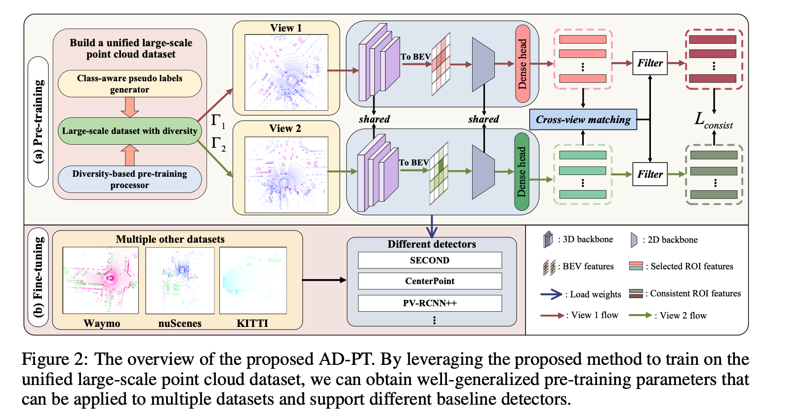
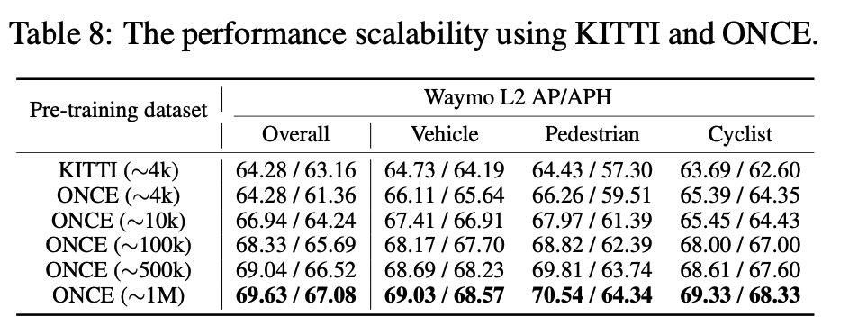
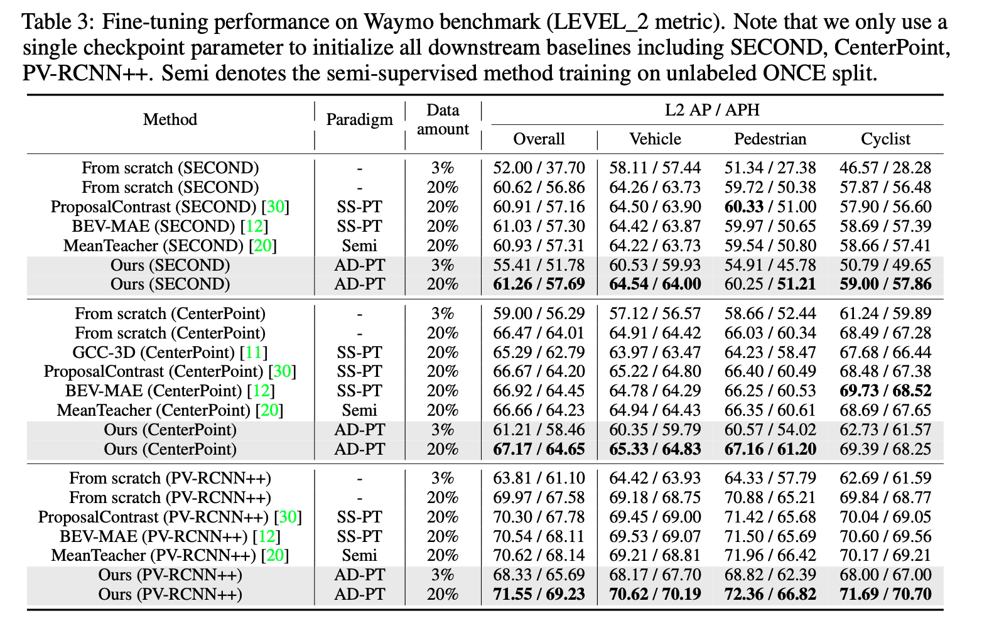

## Abstract
It is a long-term vision for Autonomous Driving (AD) community that the perception models can learn from a large-scale point cloud dataset, to obtain unified representations that can achieve promising results on different tasks or benchmarks. Previous works mainly focus on the self-supervised pre-training pipeline, meaning that they perform the pre-training and fine-tuning on the same benchmark, which is difficult to attain the performance scalability and cross-dataset application for the pre-training checkpoint.  In this paper, for the first time, we are committed to building a large-scale pre-training point-cloud dataset with diverse data distribution, and meanwhile learning generalizable representations from such a diverse pre-training dataset. We formulate the point-cloud pre-training task as a semi-supervised problem, which leverages the few-shot labeled and massive unlabeled point-cloud data to generate the unified backbone representations that can be directly applied to many baseline models and benchmarks, decoupling the AD-related pre-training process and downstream fine-tuning task. During the period of backbone pre-training, by enhancing the scene- and instance-level distribution diversity and exploiting the backbone's ability to learn from unknown instances, we achieve significant performance gains on a series of downstream perception benchmarks including Waymo, nuScenes, and KITTI, under different baseline models like PV-RCNN++, SECOND, CenterPoint.

## Motivation
This paper is focused on achieving the AD-related pre-training which can be easily applied to different baseline models and benchmarks. By conducting extensive experiments, we argue that there are two key issues that need to be solved for achieving the real AD-PT: 

- 1) how to build a unified AD dataset with diverse data distribution
- 2) how to learn generalizable representations from such a diverse dataset by designing an effective pre-training method.

For the first item, we use a large-scale point cloud dataset named ONCE, consisting of few-shot labeled (e.g.,~0.5%) and massive unlabeled data. First, to get accurate pseudo labels of the massive unlabeled data that can facilitate the subsequent pre-training task, we design a class-wise pseudo labeling strategy that uses multiple models to annotate different semantic classes, and then adopt semi-supervised methods (e.g., MeanTeacher) to further improve the accuracy on the ONCE validation set. Second, to get a unified dataset with diverse raw data distribution from both LiDAR beam and object sizes, inspired by previous works, we exploit point-to-beam playback re-sampling and object re-scaling strategies to diversify both scene- and region-level distribution.

For the second item, we find that the taxonomy differences between the pre-training ONCE dataset and different downstream datasets are quite large, resulting in that many hard samples with taxonomic inconsistency are difficult to be accurately detected during the fine-tuning stage. As a result, taxonomy differences between different benchmarks should be considered when performing the backbone pre-training. Besides, our study also indicates that during the pre-training process, the backbone model tends to fit with the semantic distribution of the ONCE dataset, impairing the perception ability on downstream datasets having different semantics. To address this issue, we propose an unknown-aware instance learning to ensure that some background regions on the pre-training dataset, which may be important for downstream datasets, can be appropriately activated by the designed pre-training task. Besides, to further mine representative instances during the pre-training, we design a consistency loss to constrain the pre-training representations from different augmented views to be consistent.

  

 

## Framework
The overview of the proposed AD-PT. By leveraging the proposed method to train on the unified large-scale point cloud dataset, we can obtain well-generalized pre-training parameters that can be applied to multiple datasets and support different baseline detectors. For more details, please refer to our original paper.

  

 

## Experimental Results
Excitingly, we observe that, the detection performance of downstream datasets (different datasets and different models) is continuously improved, as more pre-training data are used as shown below.

  

Results on Waymo validation set are shown in below. We first compare the proposed method with previous SS-PT methods. It can be seen that all three detectors achieve the best results using AD-PT initialization, surpassing previous SS-PT methods even using a smaller pre-training dataset. For example, the improvement achieved by PV-RCNN++ is 1.58% / 1.65% in terms of L2 AP / APH. Note that the compared SS-PT methods are pre-trained on Waymo 100% unlabeled train set (~150k frames), which has a smaller domain gap with fine-tuning data. Further, to verify the effectiveness of fine-tuning with a small number of samples, we conduct experiments of fine-tuning on 3\% Waymo train set (~5K frames).  We can observe that, with the help of pre-trained prior knowledge, fine-tuning with a small amount of data can achieve much better performance than training from scratch (e.g., 3.41% / 14.08% in L2 using SECOND as baseline). In addition, to ensure the fairness of the experiments, we compare our method with semi-supervised learning methods which are identical to our pre-training setup. 

  

## Conclusion
In this work, we have proposed the AD-PT paradigm, aiming to pre-train on a unified dataset and transfer the pre-trained checkpoint to multiple downstream datasets. We comprehensively verify the generalization ability of the built unified dataset and the proposed method by testing the pre-trained model on different downstream datasets including Waymo, nuScenes, and KITTI, and different 3D detectors including PV-RCNN, PV-RCNN++, CenterPoint, and SECOND.

[Download paper here](https://arxiv.org/abs/2306.00612)