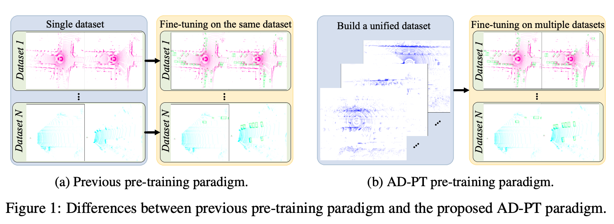

## Abstract
Excitingly, we observe that, the detection performance of downstream datasets (different datasets and different models) is continuously improved, as more pre-training data are used as shown below.

  

 

## Framework
The overview of the proposed AD-PT. By leveraging the proposed method to train on the unified large-scale point cloud dataset, we can obtain well-generalized pre-training parameters that can be applied to multiple datasets and support different baseline detectors. For more details, please refer to our original paper.

  

 

## Experimental Results

  

  

## Conclusion
In this work, we have proposed the AD-PT paradigm, aiming to pre-train on a unified dataset and transfer the pre-trained checkpoint to multiple downstream datasets. We comprehensively verify the generalization ability of the built unified dataset and the proposed method by testing the pre-trained model on different downstream datasets including Waymo, nuScenes, and KITTI, and different 3D detectors including PV-RCNN, PV-RCNN++, CenterPoint, and SECOND.

[Download paper here](https://arxiv.org/abs/2306.00612)