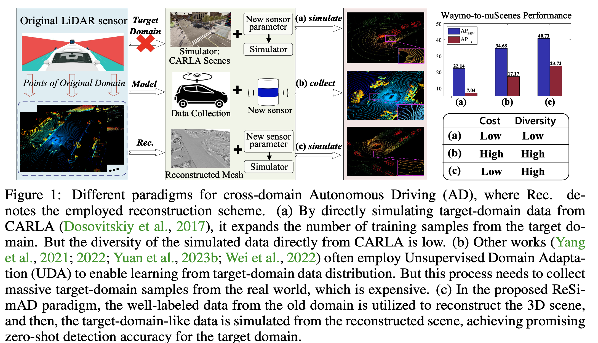
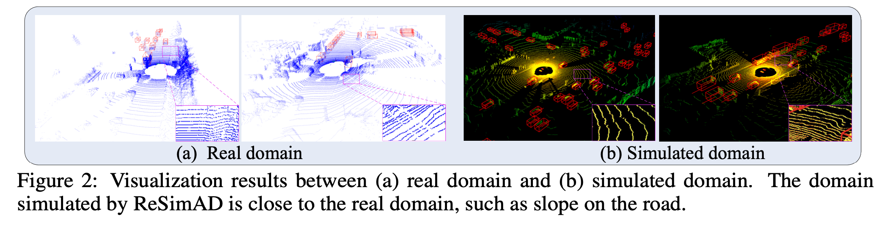
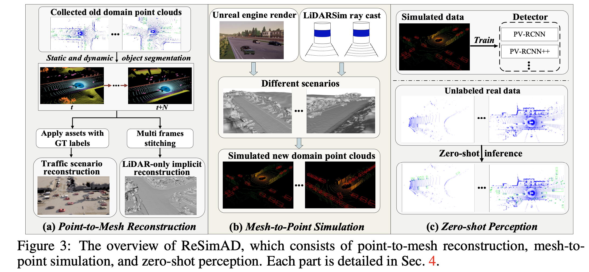
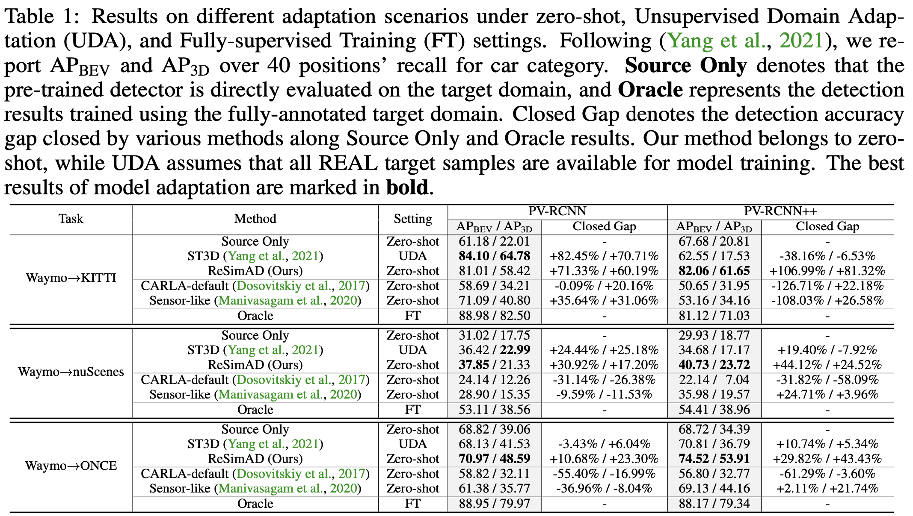

## Abstract
Domain shifts such as sensor type changes and geographical situation variations are prevalent in Autonomous Driving (AD), which poses a challenge since AD model relying on the previous domain knowledge can be hardly directly deployed to a new domain without additional costs. In this paper, we provide a new perspective and approach of alleviating the domain shifts, by proposing a Reconstruction-Simulation-Perception (ReSimAD) scheme. Specifically, the implicit reconstruction process is based on the knowledge from the previous old domain, aiming to convert the domain-related knowledge into domain-invariant representations, e.g., 3D scene-level meshes. Besides, the point clouds simulation process of multiple new domains is conditioned on the above reconstructed 3D meshes, where the target-domain-like simulation samples can be obtained, thus reducing the cost of collecting and annotating new-domain data for the subsequent perception process. For experiments, we consider different cross-domain situations such as Waymo-to-KITTI, Waymo-to-nuScenes, Waymo-to-ONCE, etc, to verify the zero-shot target-domain perception using ReSimAD. Results demonstrate that our method is beneficial to boost the domain generalization ability, even promising for 3D pre-training.

## Motivation 

  

Different paradigms for cross-domain Autonomous Driving (AD), where Rec. denotes the employed reconstruction scheme. (a) By directly simulating target-domain data from CARLA, it expands the number of training samples from the target do- main. But the diversity of the simulated data directly from CARLA is low. (b) Other works often employ Unsupervised Domain Adapta- tion (UDA) to enable learning from target-domain data distribution. But this process needs to collect massive target-domain samples from the real world, which is expensive. (c) In the proposed ReSi- mAD paradigm, the well-labeled data from the old domain is utilized to reconstruct the 3D scene, and then, the target-domain-like data is simulated from the reconstructed scene, achieving promising zero-shot detection accuracy for the target domain.

## ReSimAD dataset

  

You could refer to [Here](https://github.com/PJLab-ADG/3DTrans/blob/master/docs/GETTING_STARTED_ReSim.md) for our dataset downloading.

## Framework

  

The overview of ReSimAD, which consists of point-to-mesh reconstruction, mesh-to- point simulation, and zero-shot perception. Please refer to our paper for more details.

 

## Experimental Results

  

Table 1 shows the results of leveraging Unsuervised Domain Adaptation (UDA) technique. The major difference between UDA and ReSimAD is that, the former employs samples from real scenes of the target domain for model adaptation, while the latter cannot access any real point cloud data from the target domain. From Table 1, the cross-domain results achieved by
our ReSimAD are comparable to that achieved by UDA method. This result indicates that our method can greatly reduce the cost of data acquisition, and further, shorten the development cycle of model retraining when the LiDAR sensor needs to be upgraded for business purposes.

## Conclusion
In this work, we study how to achieve a zero-shot domain transfer, and present ReSimAD consisting of a real-world point-level implicit reconstruction process and a mesh-to-point rendering process. We have conducted extensive experiments under zero-shot settings, and their results demonstrate the effectiveness of ReSimAD in producing target-domain-like samples and achieving high target- domain perception ability, even helpful for 3D pre-training.

[Download paper here](https://arxiv.org/abs/2309.05527)