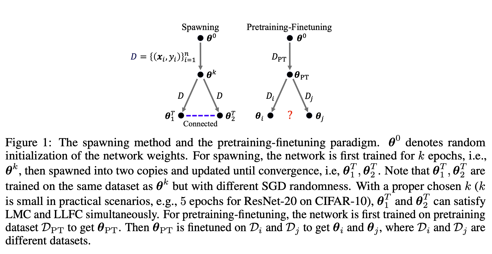
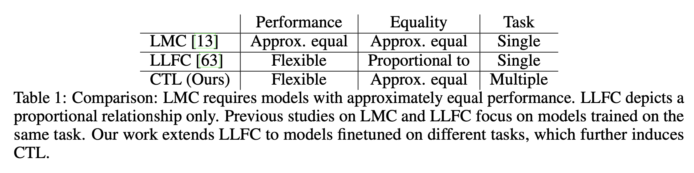
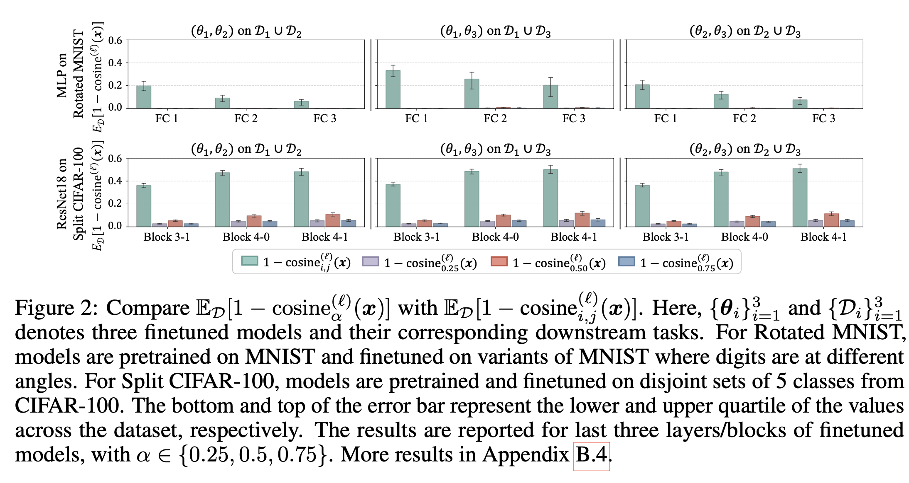
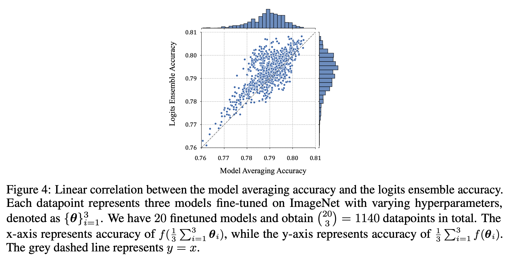

## Abstract
The pretraining-finetuning paradigm has become the prevailing trend in modern deep learning. In this work, we discover an intriguing linear phenomenon in models that are initialized from a common pretrained checkpoint and finetuned on different tasks, termed as Cross-Task Linearity (CTL). Specifically, if we linearly interpolate the weights of two finetuned models, the features in the weight-interpolated model are approximately equal to the linear interpolation of features in two finetuned models at each layer. Such cross-task linearity has not been noted in peer literature. We provide comprehensive empirical evidence supporting that CTL consistently occurs for finetuned models that start from the same pretrained checkpoint. We conjecture that in the pretraining-finetuning paradigm, neural networks essentially function as linear maps, mapping from the parameter space to the feature space. Based on this viewpoint, our study unveils novel insights into explaining model merging/editing, particularly by translating operations from the parameter space to the feature space. Furthermore, we delve deeper into the underlying factors for the emergence of CTL, emphasizing the impact of pretraining.

## Motivation 

  

Recent works on Linear Mode Connectivity (LMC) [38, 13] and Layerwise Linear Feature Con- nectivity (LLFC) [63] shed light on understanding the training dynamics and hidden mechanisms of neural networks. LMC depicts a linear path in the parameter space of a network where the loss remains approximately constant (see Definition 1). In other words, linearly interpolating the weights of two different models, which are of the same architecture and trained on the same task, could lead to a new model that achieves similar performance as the two original models. LLFC indicates that the features in the weight-interpolated model are proportional to the linear interpolation of the features in the two original models (see Definition 2). Frankle et al. [13] observed LMC for networks that are jointly trained for a short time before undergoing independent training on the same dataset, termed as spawning method (see Figure 1). Zhou et al. [63] discovered the models that linearly connected in the loss landscape are also linearly connected in feature space, i.e., satisfy LMC and LLFC simultaneously.

As shown in Figure 1, a connection is identified between the pretraining-finetuning paradigm and the spawning method, as both entail training models from a same pretrained checkpoint. Therefore, a natural question arises: are models, initialized from a common pretrained checkpoint3 but finetuned on different tasks, linearly connected in the loss landscape or feature space, akin to the models obtained by the spawning method satisfying LMC and LLFC?

In this work, we discover that the finetuned models are linearly connected in internal features even though there is no such connectivity in the loss landscape, i.e., LLFC holds but LMC not. Indeed, we identify a stronger notion of linearity than LLFC: if we linearly interpolate the weights of two models that finetuned on different tasks, the features in the weight-interpolated model are approximately equal to the linear interpolation of features in the two finetuned models at each layer, namely Cross-Task Linearity (CTL) (see comparison among LMC, LLFC, and CTL in Table 1).

## Theoretical analysis

Please see our paper for more analysis and details.

  

## Framework

  

 

## Experimental Results

  

## Conclusion
In this work, we identified Cross-Task Linearity (CTL) as a prevalent phenomenon that consistently occurs for finetuned models, approximately characterizing neural networks as linear maps in the pretraining-finetuning paradigm. Based on the observed CTL, we obtained novel insights into two widely-used model merging/editing techniques: model averaging and task arithmetic. Furthermore, we studied the root cause of CTL and highlighted the impact of pretraining.

Similar to recent efforts [63] in the neural network linearity discovery, our current work primarily focuses on empirical findings, despite a limited theoretical attempt to prove CTL in Section 5. We defer a thorough theoretical analysis to future work. Additionally, on the practical side, due to constraints in computational resources, we leave the exploration of CTL on Large Language Models to future.

[Download paper here](https://arxiv.org/abs/2402.03660)