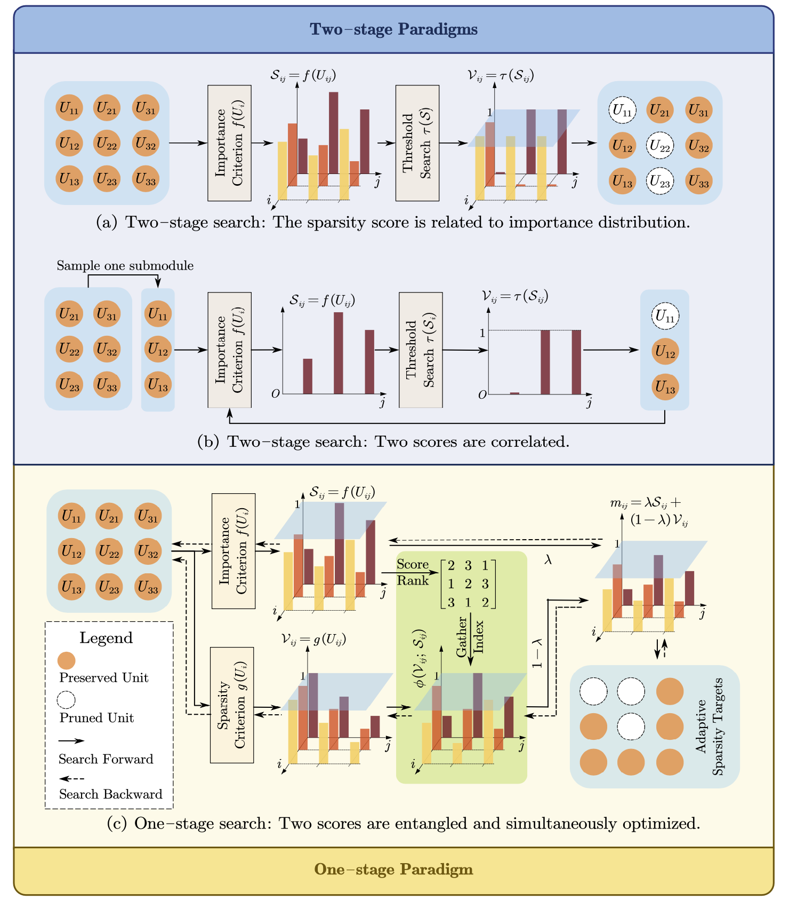
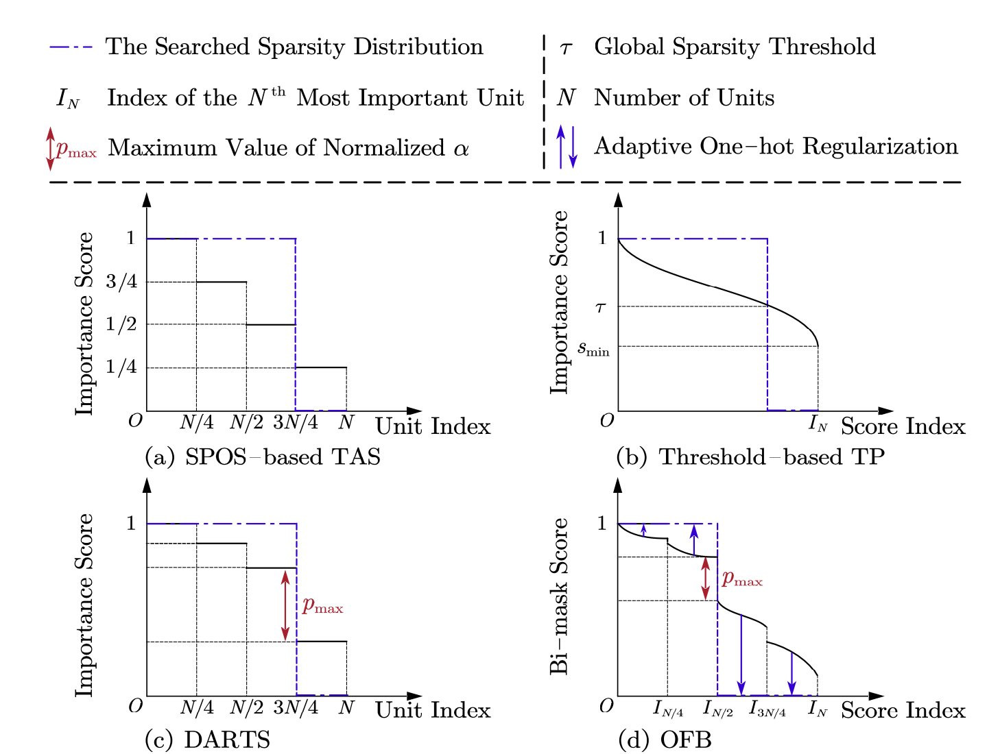
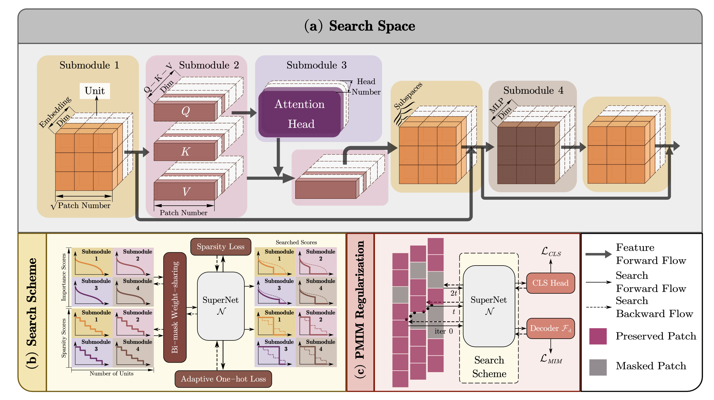
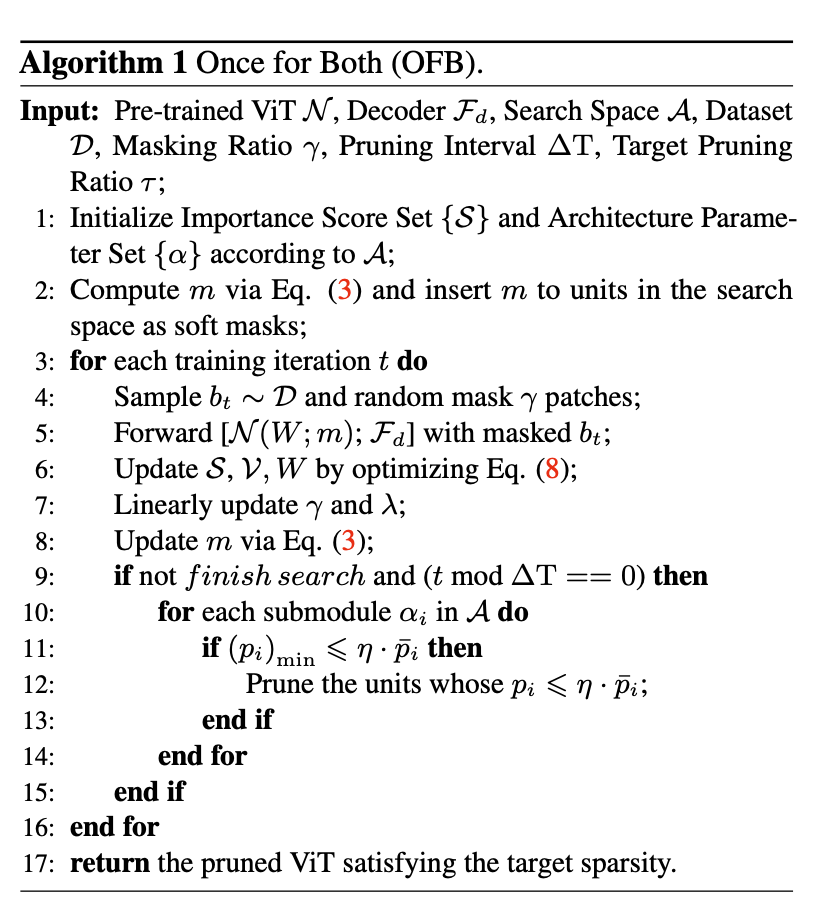
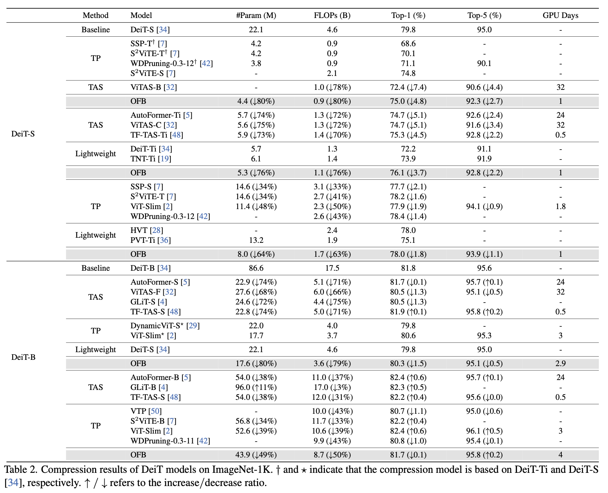
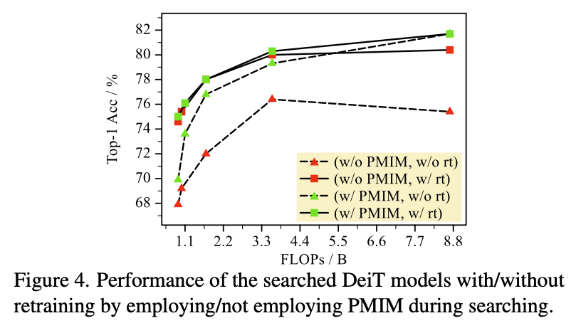
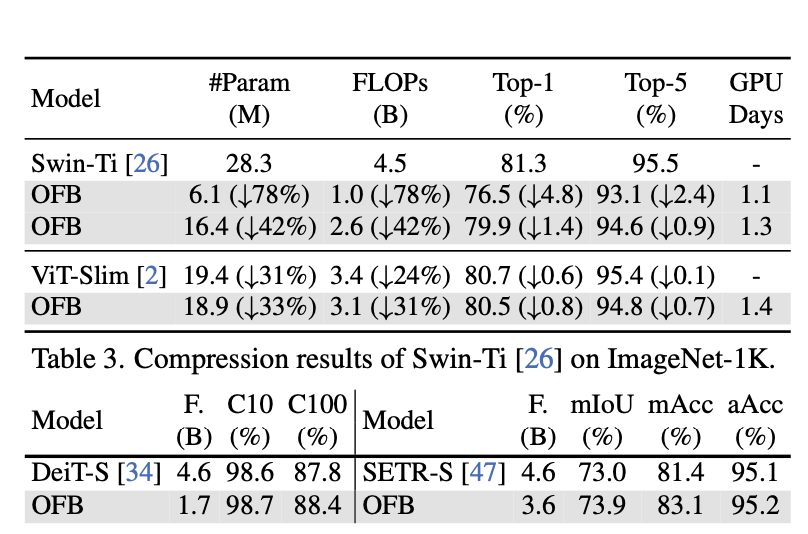

## Abstract
Recent Vision Transformer Compression (VTC) works mainly follow a two-stage scheme, where the importance score of each model unit is first evaluated or preset in each submodule, followed by the sparsity score evaluation ac- cording to the target sparsity constraint. Such a separate evaluation process induces the gap between importance and sparsity score distributions, thus causing high search costs for VTC. In this work, for the first time, we investigate how to integrate the evaluations of importance and sparsity scores into a single stage, searching the optimal subnets in an effi- cient manner. Specifically, we present OFB, a cost-efficient approach that simultaneously evaluates both importance and sparsity scores, termed Once for Both (OFB), for VTC. First, a bi-mask scheme is developed by entangling the importance score and the differentiable sparsity score to jointly deter- mine the pruning potential (prunability) of each unit. Such a bi-mask search strategy is further used together with a proposed adaptive one-hot loss to realize the progressive- and-efficient search for the most important subnet. Finally, Progressive Masked Image Modeling (PMIM) is proposed to regularize the feature space to be more representative during the search process, which may be degraded by the dimension reduction. Extensive experiments demonstrate that OFB can achieve superior compression performance over state-of- the-art searching-based and pruning-based methods under various Vision Transformer architectures, meanwhile pro- moting search efficiency significantly, e.g., costing one GPU search day for the compression of DeiT-S on ImageNet-1K.

## Motivation 

  

he relationship between importance and sparsity score distributions in different search paradigms. (a) Importance scores are fixed during sparsity search, and sparsity scores are related to importance scores. (b) Importance scores of one submodule are also related to the sparsity of other to-prune submodules. (c) Importance and sparsity scores are entangled and simultaneously optimized, thus correlated at forward and backward phases of searching. former Compression (VTC), as an effective technique to relieve such problems, has advanced a lot and can be divided into several types including Transformer Architecture Search (TAS) [5, 6, 15, 25, 32, 35, 48] and Transformer Pruning (TP) [2, 7, 21, 27, 31, 37, 42, 51] paradigms. Although both TAS and TP can produce compact ViTs, their search process for the target sparsity often relies on a two-stage scheme, i.e., importance-then-sparsity evaluation* for units (e.g., filters)

  

Different paradigms for VTC. (a): SPOS-based TAS implicitly encodes the piecewise-decreasing importance scores for units due to the uniform sampling in pre-training; (b): The threshold-based TP explicitly evaluates the importance scores for units and sets a global threshold to perform pruning; (c): DARTS learns the importance distribution in a differentiable manner and selects the subnet of the highest architecture score; (d): OFB pro- poses the bi-mask score that entangles importance and sparsity scores together, to perform the search process in a single stage.

## Framework

  

Figure 3. The overview of OFB search framework, including the design of search space, search scheme, and regularization scheme. (a) For the search space, we consider four types of submodules. (b) For the search scheme, we simultaneously learn the importance score S and the sparsity score V based on the bi-mask weight-sharing strategy, under the guidance of an adaptive one-hot loss. (c) The PMIM technique is developed to augment the pruned feature space, which introduces a progressive masking strategy to MIM for better regularization.

  

 

## Experimental Results

  

  

  

## Conclusion
We introduce OFB to tackle the VTC problem. To determine the unit prunability in ViTs, for the first time, OFB explores how to entangle the importance and sparsity scores during search. And a PMIM regularization strategy is specially designed for the dimension-reduced feature space in VTC. Extensive experiments have been conducted to compress various ViTs on ImageNet and downstream benchmarks, indicating an excellent compression capability for ViTs.

[Download paper here](https://arxiv.org/abs/2403.15835)