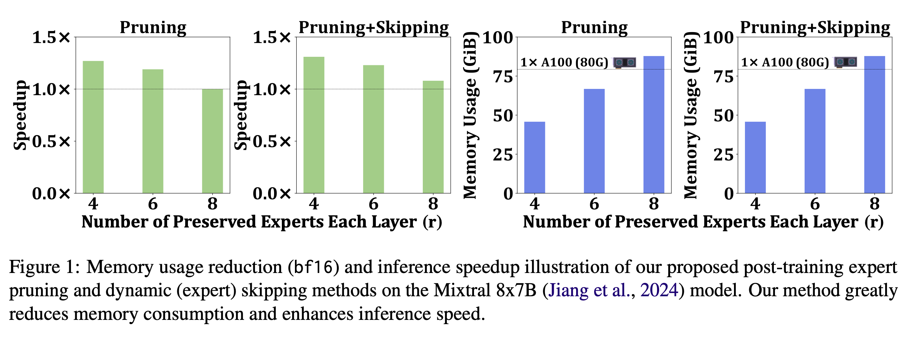
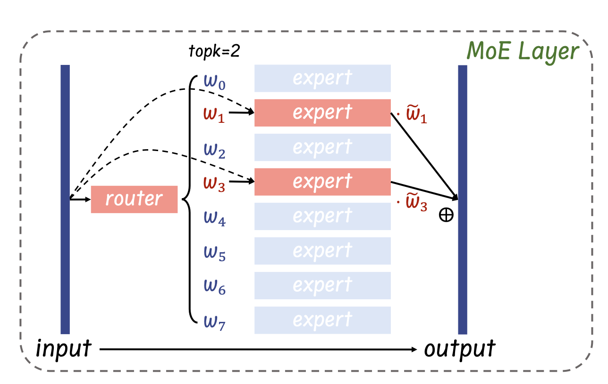
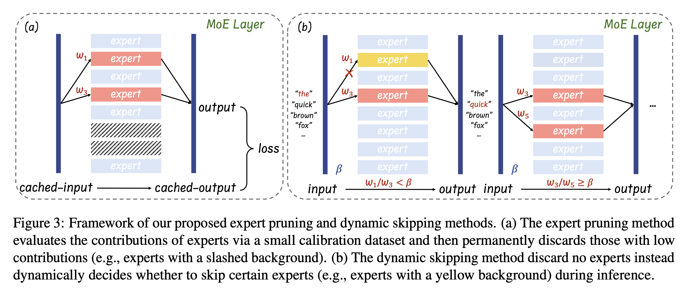
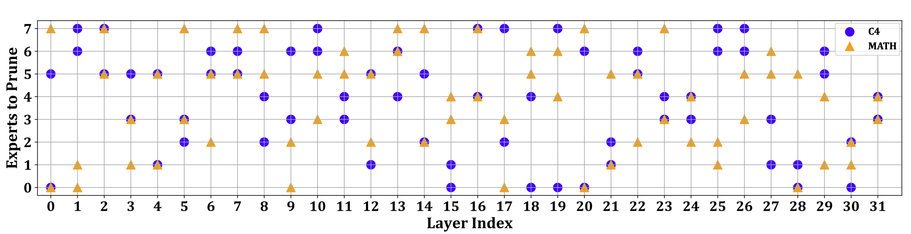
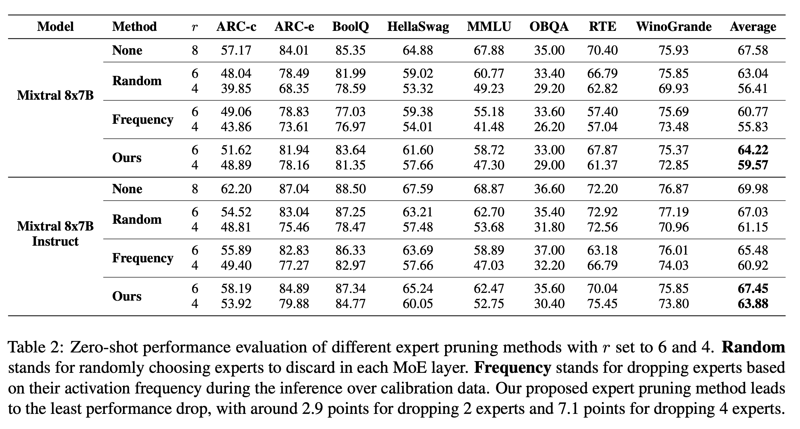
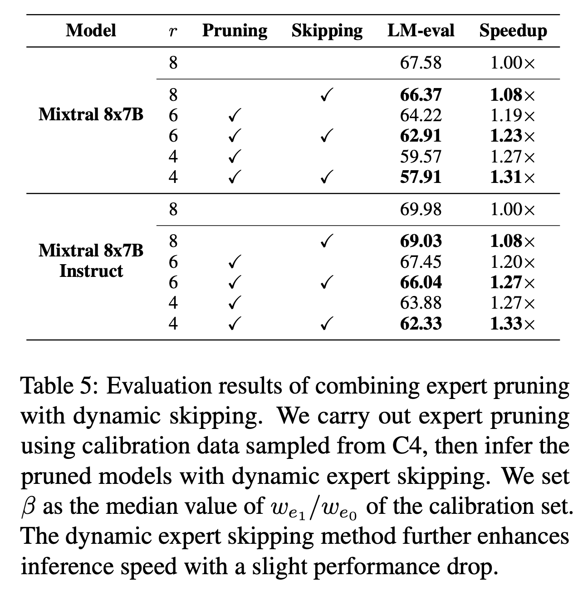

## Abstract
A pivotal advancement in the progress of large language models (LLMs) is the emergence of the Mixture-of-Experts (MoE) LLMs. Compared to traditional LLMs, MoE LLMs can achieve higher performance with fewer parameters, but it is still hard to deploy them due to their immense parameter sizes. Different from previous weight pruning methods that rely on specifically designed hardware, this paper mainly aims to enhance the deployment efficiency of MoE LLMs by introducing plug-and-play expert-level sparsification techniques. Specifically, we propose, for the first time to our best knowledge, post-training approaches for task-agnostic and task-specific expert pruning and skipping of MoE LLMs, tailored to improve deployment efficiency while maintaining model performance across a wide range of tasks. Extensive experiments show that our proposed methods can simultaneously reduce model sizes and increase the inference speed, while maintaining satisfactory performance.

## Motivation 

  

Memory usage reduction (bf16) and inference speedup illustration of our proposed post-training expert pruning and dynamic (expert) skipping methods on the Mixtral 8x7B model. Our method greatly reduces memory consumption and enhances inference speed.

In this paper, we systematically explore expert- level sparsity in MoE LLMs and, for the first time to our best knowledge, introduce hardware-friendly post-training methods for either permanently removing unimportant experts (expert pruning) or dynamically skipping experts during inference (dynamic expert skipping). Our proposed method significantly reduces memory usage for deploying MoE LLMs and enhances their inference speed.

Initially, we investigate how to prune less important experts while maintaining satisfactory performance, utilizing an efficient post-training approach. We aim to minimize the token reconstruction loss in a layer-by-layer manner. Given the limited number of experts in a single MoE layer of the LLM, we meticulously enumerate and choose combinations of experts that yield the lowest token reconstruction loss, subsequently, concatenating them to obtain the final pruned MoE model. This strategy significantly lowers the memory demands for deploying MoE LLMs. We examine expert-level pruning for both task-agnostic and task-specific (first in literature) models, tailoring our strategies to optimize performance across a wide range of applications.

Building on this foundation, we further dive into strategies for accelerating the inference speed of MoE LLMs without compromising their robust- ness. Specifically, based on the model’s fixed expert count, we introduce an online method for dynamically skipping certain experts. This approach, which is complementary to our expert pruning strategy, allows for on-the-fly adjustment of the number of active experts during inference, thus enhancing the inference speed. By integrating the dynamic (expert) skipping approach with expert pruning, we achieve a more streamlined and efficient deployment for MoE LLMs.

## Our Insight

  

Illustration of the MoE layer in the Mixtral 8x7B model for per-token inference. The output of the layer is the weighted sum of the outputs from selected experts over input token x. w_i denotes the softmax-normalized routing weight of each selected expert.

## Framework

  

 Framework of our proposed expert pruning and dynamic skipping methods. (a) The expert pruning method evaluates the contributions of experts via a small calibration dataset and then permanently discards those with low contributions (e.g., experts with a slashed background). (b) The dynamic skipping method discard no experts instead dynamically decides whether to skip certain experts (e.g., experts with a yellow background) during inference.

 

  

Expert selection comparison between C4 and MATH dataset with r = 6 for Mixtral 8x7B model. Significant divergence is observed in the selection of experts across these two datasets, and identical expert combinations are observed in only four specific layers (i.e., layer 2, layer 4, layer16, and layer 31).

## Experimental Results

Zero-shot performance evaluation of different expert pruning methods with r set to 6 and 4. Random stands for randomly choosing experts to discard in each MoE layer. Frequency stands for dropping experts based on their activation frequency during the inference over calibration data. Our proposed expert pruning method leads to the least performance drop, with around 2.9 points for dropping 2 experts and 7.1 points for dropping 4 experts.

  

Evaluation results of combining expert pruning with dynamic skipping. We carry out expert pruning using calibration data sampled from C4, then infer the pruned models with dynamic expert skipping. We set β as the median value of we1 /we0 of the calibration set. The dynamic expert skipping method further enhances inference speed with a slight performance drop.

  

## Conclusion
In this paper, based on the structural characteris- tics of MoE LLMs and the shortcomings of current weight pruning schemes, we focus on expert-level model sparsification and, for the first time, provide post-training expert pruning together with dynamic (expert) skipping methods to enhance the deployment efficiency of MoE LLMs. Our methods can significantly reduce memory usage and enhance inference speed while maintaining high model performance. Looking ahead, we aim to further refine our pruning/skipping techniques and incorporate them with weight pruning or parameter quantization strategies, achieving more effective deploying approaches for MoE LLMs.

[Download paper here](https://arxiv.org/abs/2402.14800)