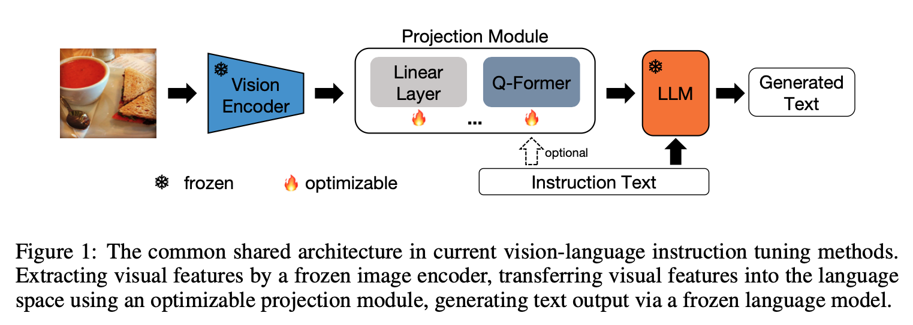
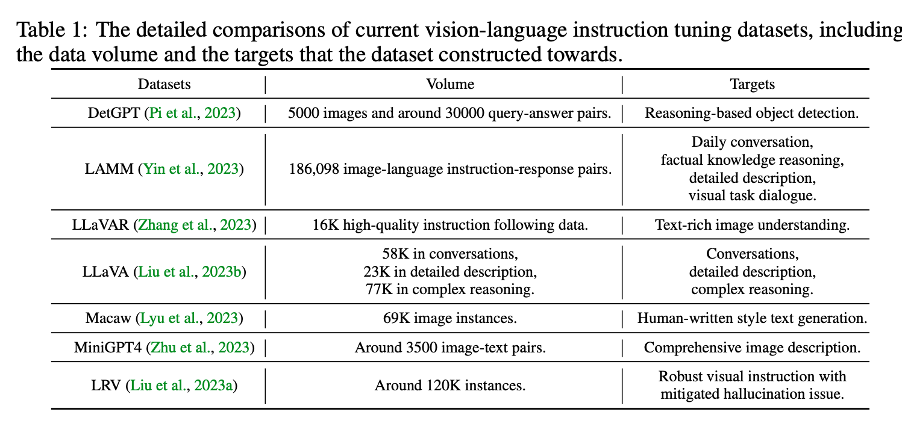
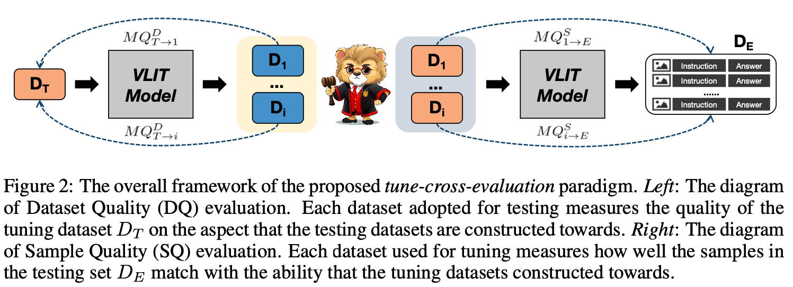
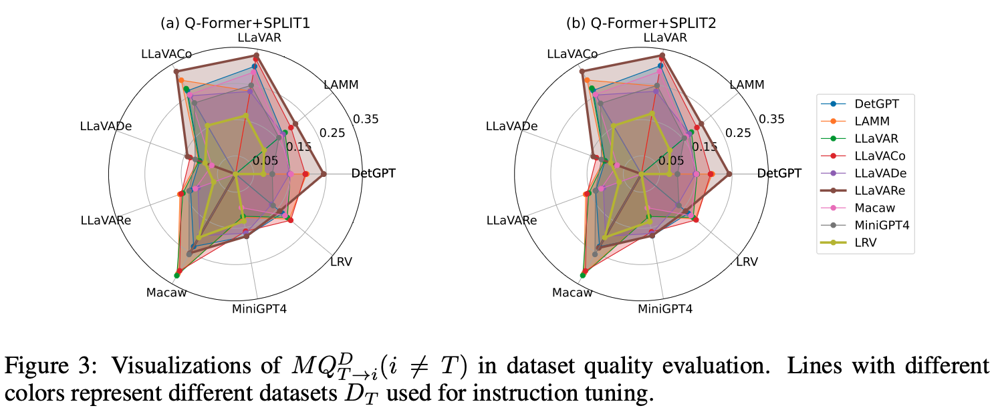
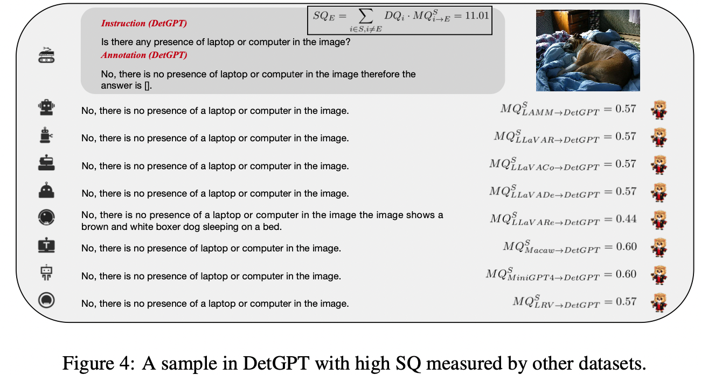
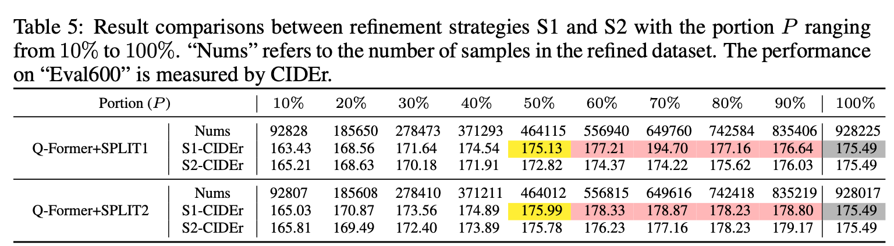

[REVO-LION](https://arxiv.org/abs/2309.10527)

# Introduction
Research on multimodal instruction tuning is recently emerging, and correspond- ingly, evaluating these models becomes an imperative requirement, which is being responded to by various proposed benchmarks. Different from these benchmarks focusing on evaluating models directly, in this paper, we delve into fundamen- tal questions from the data perspective that how comprehensive are the current Vision-Language Instruction-Tuning (VLIT) datasets, and how to build a dataset for developing an all-powerful VLIT model. To achieve effective analysis of VLIT datasets, which remains an open question, we propose a tune-cross-evaluation paradigm: tuning on one dataset and evaluating on others in turn. For each tune- evaluation set, we define the Meta Quality (MQ) as the average of scores mea- sured by BLEU, METEOR, and ROUGE-L to quantify the quality of a dataset or a sample. On this basis, to evaluate the comprehensiveness of a dataset, we develop the Dataset Quality (DQ) covering all tune-evaluation sets. To lay the foundation for building a comprehensive dataset and developing an all-powerful model, we further create the Sample Quality (SQ) quantifying the all-sided qual- ity of each sample. Extensive experiments validate the rationality of the pro- posed evaluation paradigm. According to the holistic evaluation, we build a new dataset, REVO-LION (REfining VisiOn-Language InstructiOn tuNing), by col- lecting samples with higher SQ from each dataset. With only half of the amount of the full data, the model trained on REVO-LION can achieve performance com- parable to simply adding all VLIT datasets up. In addition to developing an all- powerful model, REVO-LION also includes an evaluation set, which is expected to serve as a convenient evaluation benchmark for future research. The project page: https://github.com/liaoning97/REVO-LION.

# Motivation
Different from previous works focusing on evaluating Vision-Language Instruction-Tuning (VLIT) models, our first goal is evaluating VLIT datasets. The motivation comes from the insights into current VLIT mod- els, including two similarities and one difference: 

- (1) The first similarity is the model architecture. As shown in the following Figure, the image feature is firstly extracted by a frozen vision encoder. Then, a learnable projection module, which can be simply designed as the linear layer in LLaVA or the more sophisticated Q-Former in InstructBLIP, transfers the image feature to the language space. Finally, by feeding the transformed image feature and in- struction text into the frozen Large Language Models (LLMs), the instruction-following answer is generated.

- (2) The second similarity is the two-stage learning strategy. During training, common large-scale image-text pairs are leveraged for the cross-modal feature alignment in the first stage. Then, the customized high-quality instruction data is used to train the VLIT model to generate coherent and desired output in the second stage. 

- (3) The difference is exact the high-quality instruction data targeting at different aspects of VL understanding, as concluded in Table 1. To be more consistent with LLMs, the annotations in these datasets are almost generated or augmented by GPT. It follows that curating proper instruction datasets is essential in VLIT, and we thus hold that the essence of model evaluation is evaluating high-quality VLIT datasets.

  

## Datasets we used for evaluating and refining

  

## Framework
The overall framework of the proposed tune-cross-evaluation paradigm. Left: The diagram of Dataset Quality (DQ) evaluation. Each dataset adopted for testing measures the quality of the tuning dataset D_T on the aspect that the testing datasets are constructed towards. Right: The diagram of Sample Quality (SQ) evaluation. Each dataset used for tuning measures how well the samples in the testing set D_E match with the ability that the tuning datasets constructed towards.

  

## Experiments

  

  

  

[REVO-LION](https://arxiv.org/abs/2309.10527)